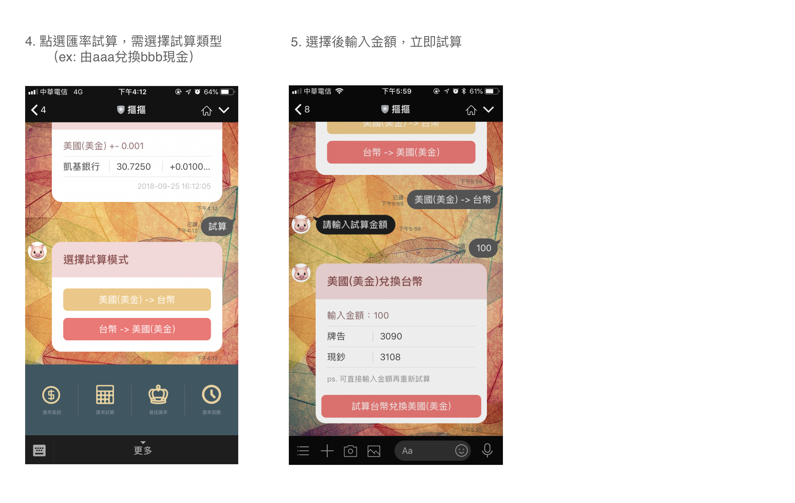
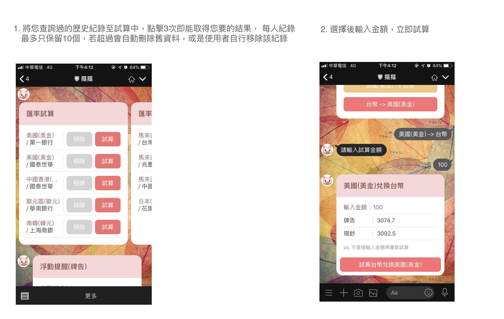
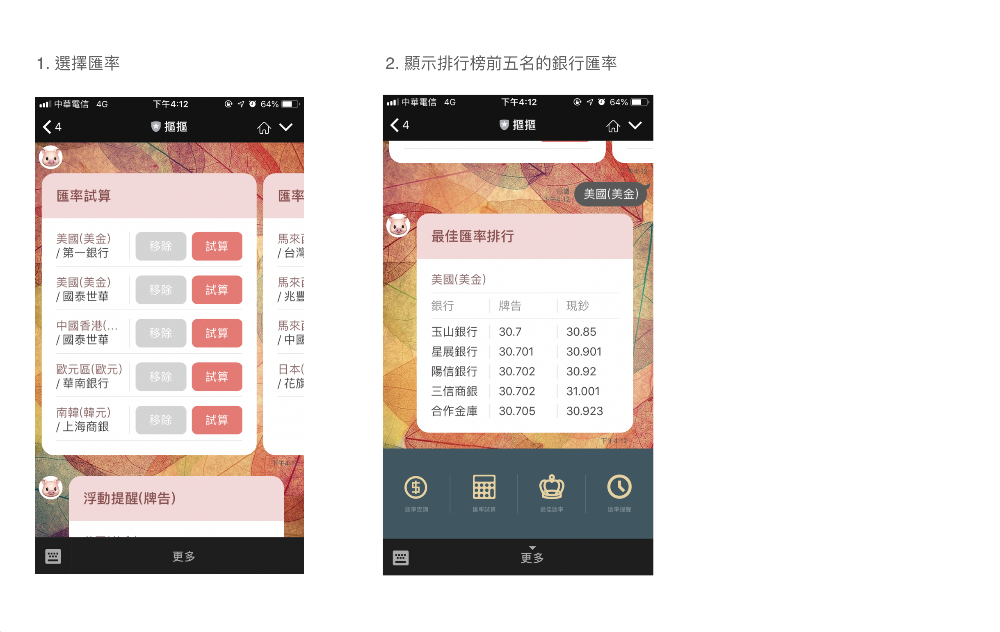
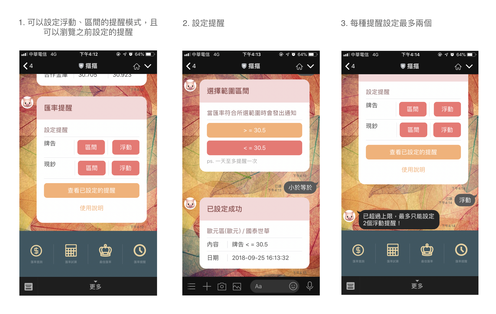

# 理財摳摳
## 簡介
這是一個匯率機器人讓時常購買外幣的人可以更方便，很多人在買外幣的時候，總是要上網查資料比對哪間銀行最便宜最好，
常常要開啟很多個網頁視窗，而機器人可以提供你大部分常見貨幣及有提供購買資源的銀行資料，更棒的是，他還能紀錄您
瀏覽貨幣的資料，讓你更快速的試算匯率，只要點擊3次便能試算出你所選擇的該家銀行的貨幣，此外能讓你客製化自動推播提醒
讓機器人提醒你已達到欲購買的匯率金額，讓你不用時時關注匯率的浮動。

## 步驟說明
### 以下為機器人功能選單
+ 外匯查詢：

+ 匯率試算

+ 最佳匯率

+ 外匯提醒

## 工具
+ Linebot API：https://developers.line.me/en/reference/messaging-api/
+ phpQuery：使用php爬蟲跑排程取得資料並存入資料庫

## 資料來源
+ 牌告：https://tw.rter.info/json.php?t=currency&q=check&iso=
+ 現鈔：https://tw.rter.info/json.php?t=currency&q=cash&iso=