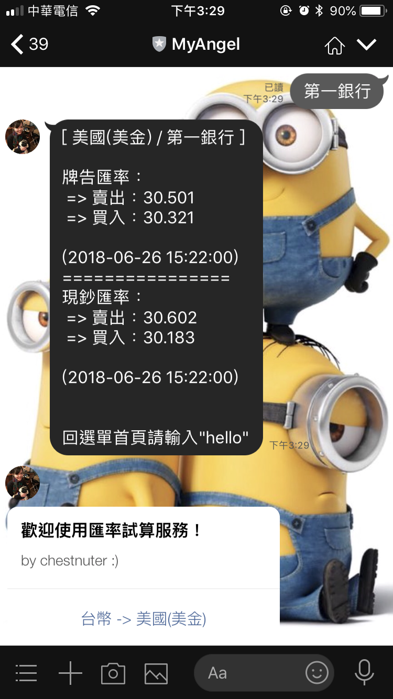

# Welcome to 理財小精靈
## 說明
+ 透過這個理財小精靈，查詢各家銀行貨幣的當前匯率，並透過試算找出對自己最有利的購買時機

## 功能介紹
1. 查看各家銀行匯率
2. 換算銀行貨幣匯率
3. 查看各家銀行匯率歷史紀錄 (未完成)

## 操作說明
### step1. 加入機器人帳號或是輸入"hello"，會跳出首頁選單
+ 
### step2. 選取貨幣後顯示相對應的銀行選單
+ 
### step3. 顯示該匯率最新查詢結果
+ 
### step4. 匯率試算 (ex: 100元美元 => 需要花3000台幣才可以兌換...)
+ 

## 相關資料參考
+ 即匯站：https://tw.rter.info
